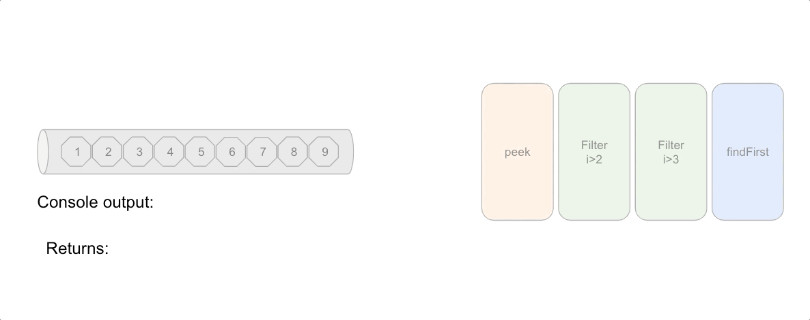

# 🧑‍🎓 tltr
```
1234
```
Print is executed multiple times till the first value that matches both filter conditions is found.

# ❓Question
```java
//What is the output?
IntStream.range(1, 10)
            .peek(System.out::print)
            .filter(i -> i > 2) //A
            .filter(i -> i > 3) //B
            .findFirst();
```

# 🕵️‍♂️ Explanation
Let's simplify it
```java
IntStream.range(1, 10);
```

This won't do anything because there is no terminal operation which triggers the reading from the source stream. 

By adding the `peek`, which is an intermediate operation, the behaviour won't change.
```java
IntStream.range(1, 10).peek(System.out::print);
```

This `findFirst` (terminal operation) evaluates the pipeline.
```java
IntStream.range(1, 10).peek(System.out::print).findFirst();
```
During the evaluation, the sinks are wrapped (combined) into one [Sink](https://en.wikipedia.org/wiki/Sink_(computing)#In_stream_processing). As a result, we get:
1. `peek` Sink
2. `filter A` Sink
3. `filter B` Sink 
4. `findFirst` Sink

**While** *the sink is not cancelled (**in our case findFirst has no value**) and there is an element in the stream, the pipeline will try to advance, fetch the next element and pass it to the wrapped sink as above (top-down)*

### ✅ Walkthrough

So we will have something like this (since the stream is not empty):



The stream: `1 2 3 4 5 6 7 8 9` 
* `1` is passed to `peek` sink
  * `peek` is executed, `1` is printed
  * `1` passed to `filter A` sink   
    * `filter A` is executed, `false` is returned `(1>2)`, the sink is not cancelled, continue the **while**
* `2` is fetched and passed to `peek` sink
  * `peek` is executed, `2` is printed
  * `2` passed to `filter A` sink
    * `filter A` is executed, `false` is returned `(2>2)`, the sink is not cancelled, continue the **while**
* `3` is fetched and passed to `peek` sink
  * `peek` is executed, `3` is printed
  * `3` passed to `filter A` sink
    * `filter A` is executed, `true` is returned `(3>2)`
  * `3` passed to`filter B` sink
    * `filter B` is executed, `false` is returned `(3>3)`, the sink is not cancelled, continue the **while**
* `4` is fetched and passed to `peek` sink
  * `peek` is executed, `4` is printed
  * `4` passed to `filter A` sink
    * `filter A` is executed, `true` is returned `(4>2)`
  * `4` passed to `filter B` sink
    * `filter B` is executed, `true` is returned `(4>3)`
  * `4` passed to `findFirst` sink
    * saves the value inside the `findFirst` which means the sink is cancelled, **while** interrupted
* `4` returned


# Another Example
Let's move the `peek` before the `findFirst`. Almost the same code, and different output
```java
//What is the output?
IntStream.range(1, 10)
            .filter(i -> i > 2) //A
            .filter(i -> i > 3) //B
            .peek(System.out::print)
            .findFirst();
```
Output:
```
4
```
The sink:
1. `filter A` Sink
2. `filter B` Sink 
3. `peek` Sink
4. `findFirst` Sink

### ✅ Walkthrough

So we will have something like this: \
The stream: `1 2 3 4 5 6 7 8 9` 

* `1` is passed to `filter A` sink
  * `filter A` is executed, `false` is returned `(1>2)`, the sink is not cancelled, continue the **while**  
* `2` is fetched and passed to `filter A` sink
  * `filter A` is executed, `false` is returned `(2>2)`, the sink is not cancelled, continue the **while**
* `3` is fetched and passed to `filter A` sink
  * `filter A` is executed, `true` is returned `(3>2)`
  * `3` passed to`filter B` sink
    * `filter B` is executed, `false` is returned `(3>3)`, the sink is not cancelled, continue the **while**
* `4` is fetched and passed to `filter A` sink
  * `filter A` is executed, `true` is returned `(4>2)`
  * `4` passed to`filter B` sink
    * `filter B` is executed, `true` is returned `(4>3)`
* `4` is passed to `peek` sink
  * `4` is printed
* `4` is passed to `findFirst` sink
  * saves the value inside the `findFirst` which means the sink is cancelled, **while** interrupted
* `4` returned


